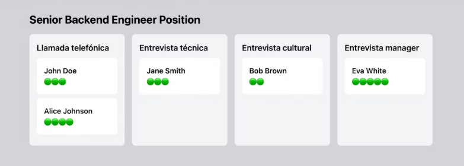

Crear la interfaz "position", una página en la que poder visualizar y gestionar los diferentes candidatos de una posición específica.

La interfaz debe ser tipo kanban, mostrando los candidatos como tarjetas en diferentes columnas que representan las fases del proceso de contratación, y pudiendo actualizar la fase en la que se encuentra un candidato solo arrastrando su tarjeta. Aquí tienes un ejemplo de interfaz posible:




Algunos de los requerimientos del equipo de diseño que se pueden ver en el ejemplo son:

- Se debe mostrar el título de la posición en la parte superior, para dar contexto

- ñadir una flecha a la izquierda del título que permita volver al listado de posiciones

- Deben mostrarse tantas columnas como fases haya en el proceso

- La tarjeta de cada candidato/a debe situarse en la fase correspondiente, y debe mostrar su nombre completo y su puntuación media

- Si es posible, debe mostrarse adecuadamente en móvil (las fases en vertical ocupando todo el ancho)

Algunas observaciones:

- Asume que la página de posiciones la encuentras 

- Asume que existe la estructura global de la página, la cual incluye los elementos comunes como menú superior y footer. Lo que estás creando es el contenido interno de la página.

Para implementar la funcionalidad de la página cuentas con diversos endpoints API que ha preparado el equipo de backend:

**GET /positions/:id/interviewFlow**
Este endpoint devuelve información sobre el proceso de contratación para una determinada posición:

* positionName: Título de la posición

* interviewSteps: id y nombre de las diferentes fases de las que consta el proceso de contratación
```json
{
      "positionName": "Senior backend engineer",
      "interviewFlow": {
              
              "id": 1,
              "description": "Standard development interview process",
              "interviewSteps": [
                  {
                      "id": 1,
                      "interviewFlowId": 1,
                      "interviewTypeId": 1,
                      "name": "Initial Screening",
                      "orderIndex": 1
                  },
                  {
                      "id": 2,
                      "interviewFlowId": 1,
                      "interviewTypeId": 2,
                      "name": "Technical Interview",
                      "orderIndex": 2
                  },
                  {
                      "id": 3,
                      "interviewFlowId": 1,
                      "interviewTypeId": 3,
                      "name": "Manager Interview",
                      "orderIndex": 2
                  }
              ]
          }
  }
```

**GET /positions/:id/candidates**
Este endpoint devuelve todos los candidatos en proceso para una determinada posición, es decir, todas las aplicaciones para un determinado positionID. Proporciona la siguiente información:

* name: Nombre completo del candidato
* current_interview_step: en qué fase del proceso está el candidato.
* score: La puntuación media del candidato
```json
[
      {
           "fullName": "Jane Smith",
           "currentInterviewStep": "Technical Interview",
           "averageScore": 4
       },
       {
           "fullName": "Carlos García",
           "currentInterviewStep": "Initial Screening",
           "averageScore": 0            
       },        
       {
           "fullName": "John Doe",
           "currentInterviewStep": "Manager Interview",
           "averageScore": 5            
      }    
 ]
```
 
**PUT /candidates/:id/stage**
Este endpoint actualiza la etapa del candidato movido. Permite modificar la fase actual del proceso de entrevista en la que se encuentra un candidato específico, a través del parámetro "new_interview_step" y proporionando el interview_step_id correspondiente a la columna en la cual se encuentra ahora el candidato.
```json
{
     "applicationId": "1",
     "currentInterviewStep": "3"
 }
```
```json
{    
    "message": "Candidate stage updated successfully",
     "data": {
         "id": 1,
         "positionId": 1,
         "candidateId": 1,
         "applicationDate": "2024-06-04T13:34:58.304Z",
         "currentInterviewStep": 3,
         "notes": null,
         "interviews": []    
     }
 }
 ```